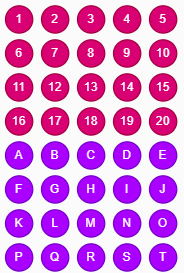

# DrawIo-Annotatinons
Annotation libraries for the Draw.IO diagrams.

There are two libraries available, one with strong colours and one with subdued colours.

  

This are the links to use when importing the libraries int Draw.io: 
* https://raw.githubusercontent.com/RubenOlsen/DrawIo-Annotatinons/master/Annotations-soft-colour.xml
* https://raw.githubusercontent.com/RubenOlsen/DrawIo-Annotatinons/master/Annotations-strong-colour.xml

